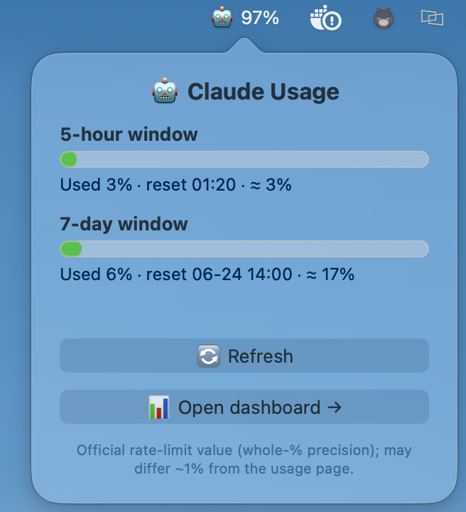
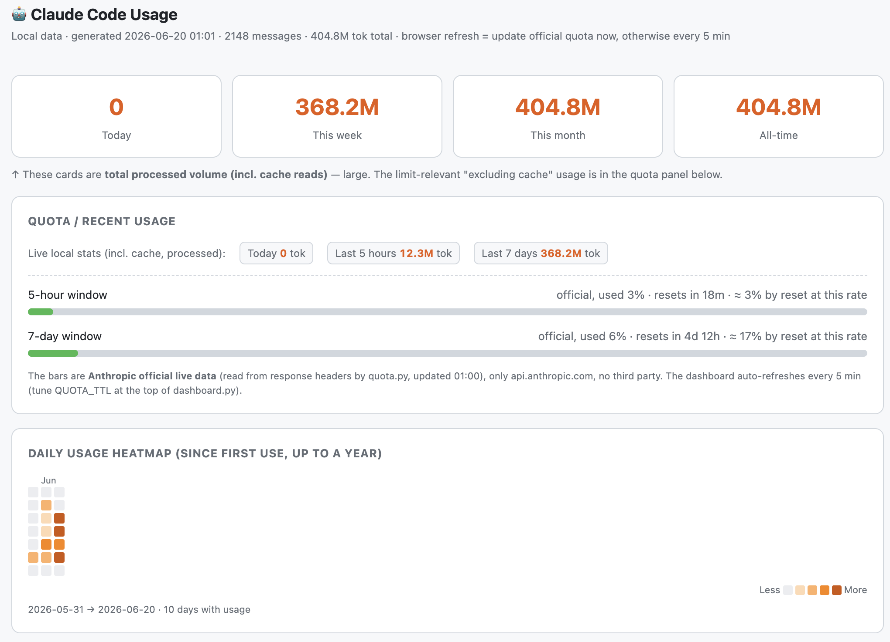
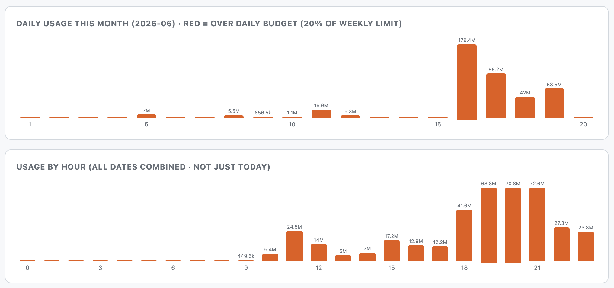

# claude-usage-peek

**English** · [中文](README.zh.md) · [日本語](README.ja.md)

> Built entirely with [Claude Code](https://claude.com/claude-code).

**A lightweight, secure, local macOS menu bar app to see your Claude Code usage.**

Keep your Claude **5-hour and 7-day rate-limit quota** one click away in the **menu bar**,
and expand a full local **usage dashboard** — token charts, a daily heatmap, and per-model
breakdown — whenever you want detail.

Unlike CLI token counters, it reads Anthropic's **official** 5h / 7d rate-limit % — your
real remaining quota — not just a local token tally, and it lives in your menu bar.

<p align="center">
  
</p>

- **Collects nothing about you** — no tracking, no analytics; nothing about you ever leaves your Mac.
- **Lightweight** — just a small menu-bar icon; nothing to `pip install`, no background heavy lifting.
- **Safe** — read-only. It never changes your Claude data.

A 🤖 icon sits in your menu bar showing how much of your 5-hour quota is left.
Click it for a small panel with your 5h / 7d limits and reset times, or expand it
into a full HTML dashboard with charts and a usage heatmap.

> **🔒 Local & safe.** Everything runs on your machine. **Your usage data is never
> uploaded, sent out, or routed through any third party.** Nothing in your Claude data
> is modified. The only network access is a single read to the **official
> `api.anthropic.com`**, using your own Claude Code login token, to fetch your real
> quota % (read-only; no data sent; the token is never written to disk or printed).

## Requirements

- **macOS 13+**
- **Python 3** — the engine that reads your usage and your quota (`python3` on your PATH)
- **Xcode Command Line Tools** (for `swiftc`, to build the app once) —
  install with `xcode-select --install`

> No `pip install`, no third-party packages, no account, no configuration.

## Install

1. **Download this folder** (clone or download the ZIP).
2. **Build the app** — double-click `build_menubar.command` in Finder, or in Terminal:
   ```bash
   bash build_menubar.command
   ```
   It asks for your **interface language** (English / 中文 / 日本語 — default English;
   you can change it later), compiles, and puts **Claude Usage Bar.app** on your Desktop.
3. **Open the app** — double-click `Claude Usage Bar.app`. A 🤖 appears in your menu bar.

> Moved the folder? Just run `build_menubar.command` again.
>
> Start at login: right-click the 🤖 → **Start at login** (toggles a checkmark). Or add it
> manually in **System Settings → General → Login Items**.

## Using the app

- **Left-click** the 🤖 → a panel showing:
  - **5-hour window** and **7-day window** progress bars (fill = how much you've used,
    green → orange → red), the **used %**, the **reset time**, and a **projection** of
    where you'll land by reset at the current rate
  - **🔄 Refresh** — re-fetch your official quota
  - **📊 Open dashboard →** — launch the full HTML dashboard in your browser
- **Right-click** the 🤖 → a small menu: **Refresh quota** / **Open dashboard** /
  **Language** / **Start at login** / **Check for updates** / **Quit**.

### Changing the language

You pick a language when you install (default English). To change it later, **right-click
the 🤖 icon → Language**, then choose **English / 中文 / 日本語**. It switches right away and
is remembered the next time you open the app — no rebuild needed. The expanded HTML
dashboard opens in the selected language too.

### Updates (optional, off by default)

Update checking is **off by default** — for privacy, the app asks once on first launch
whether to enable it, and you can toggle it anytime via right-click → **Check for updates**.
When on, the app checks GitHub for a newer version (a tiny version-number request, no data
about you is sent) and, if there's one, shows a notification, a **•** on the menu-bar icon,
and an **Update** item in the menu. Clicking it opens the repo; to update, `git pull` and
re-run `bash build_menubar.command`.

## What the numbers mean

- **5h / 7d %** = your **whole Anthropic account's** official limits (web, desktop,
  Claude Code, API — this is Anthropic's unified limit), fetched from the official API.
- **The dashboard charts** = your **local *Claude Code* usage** (terminal CLI, VS Code
  and other IDE extensions — anything that writes sessions to `~/.claude/projects/`).
  It does **not** include claude.ai web or the Claude desktop chat app.

The dashboard is a self-contained HTML page (no JavaScript, no CDN) with cards for
today / this week / this month / all-time tokens, the official 5h/7d bars with reset
countdowns, a GitHub-style daily heatmap, an hourly bar chart, and a per-model breakdown.
Its local server listens on `127.0.0.1` only.





## Uninstall

```bash
bash uninstall.command   # or double-click it in Finder
```

It quits the menu-bar app and background services, removes the Desktop app, caches,
logs, and language preference, and (optionally) deletes the folder. Nothing system-level
was ever installed, so removal is clean.

## Advanced — command-line tools (optional)

The app is powered by small, auditable Python scripts you can also run directly:

```bash
python3 usage.py            # per-day + per-model token summary (add --json for raw)
python3 dashboard.py        # generate & open the HTML dashboard
python3 dashboard.py --serve  # live dashboard at http://127.0.0.1:8787
python3 quota.py            # print official 5h/7d % (one call to api.anthropic.com)
python3 watch.py            # background watchdog: macOS notification at 50/75/90%
```

You can also wire `usage.py` into the Claude Code terminal **statusline** — see
[usage.py](usage.py). (The statusline renders in the terminal CLI only, not the VS Code panel.)

## Security

- The usage stats read local files only and **never go online**. The only network
  call is `quota.py`: one request to **api.anthropic.com** (official) with your local
  Claude Code token to read your real quota %. **No third party; the token is never
  written to disk or printed.** Data under `~/.claude/projects` is never modified.
- The menu-bar app reads only the quota cache (`~/.claude/usage-peek-quota.json`) and
  launches the bundled Python scripts. Its one possible network call is the **optional,
  off-by-default** update check (a GET of a version number from GitHub, no data sent) —
  it stays silent unless you turn it on.
- No third-party dependencies, single-file scripts you can audit: [usage.py](usage.py),
  [quota.py](quota.py).
